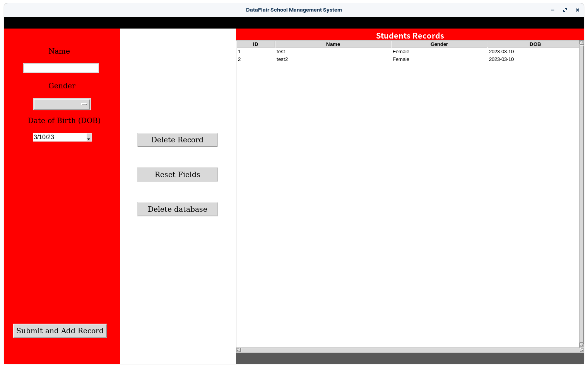

 
  

  &#xa0;

<h1 align="center">Student Management</h1>

  

  

  

  

  

  

  

Made with :heart: by <a href="https://github.com/tmchuynh" target="_blank">Tina Huynh</a>

&#xa0;

<a href="#top">Back to top</a>
